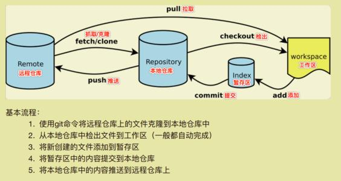
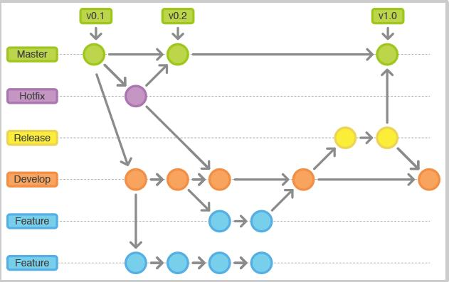

# 什么是Git

- Git是分布式版本控制。

- 所有代码的版本信息都在中心处理器中，同时全部的历史版本都可以同步到本地每个用户，可以查看本地历史版本，可以离线本地提交，只需在连网时，push代码到相应的服务器或其他用户的服务器。由于每个用户本地保存的都是所有的数据，只要有一个用户的设备没有问题，就可以恢复所有的数据，但这增加了本地存储空间的占用。

# Git与SVN的区别

- **SVN是集中式版本控制系统**，版本库是集中放在中央服务器的，而工作的时候，用的都是自己的电脑，所以首先要从中央服务器得到最新的版本，然后工作。完成工作后，需要把自己做完的活推送到中央服务器。集中版本控制系统是必须联网才能工作，对网络带宽要求高。
- **Git是分布式版本控制系统**，没有中央服务器，每个人的电脑就是一个完整的版本库，工作的时候不需要联网，因为本地就是一个厂库，具有所有版本信息。团队协作的方式：比如A在本地电脑修改了文件a，其他人在电脑上改了a,这时，他们只需要把各自修改的推送给对方，就可以互相看到对方的修改。Git是目前最先进的分布式版本控制系统。

# Git环境配置

1. git官网：https://git-scm.com/
2. Downloads 下载对应的版本。
3. 安装

> 若想重装git,可查看电脑环境变量，并清理Git的配置
>
> 1. 电脑->属性->高级系统配置->环境变量->系统变量里的Path->查看是否Git的配置->有就删除
>
> 2. 控制面板->程序和功能->卸载Git
> 3. 点Git的安装包，无脑下一步，可配置安装路径。
> 4. 安装成功后，菜单栏会有：Git Bash|Git CMD|Git GUI
>
> ​        Git Bash 指Unix和Linux风格命令
>
> ​        Git CMD Windows命令风格
>
> ​        Git GUI ：图形界面

**常用linux命令**

- cd 	切换工作目录
- pwd    列出当前工作目录
- touch  新建文件
- mkdir  新建文件夹
- rm  删除文件
- ls|ll 列出当前目录下所有文件，ll列出的内容更详细
- mv   移动文件或修改文件名
- clear 清屏
- reset 清屏/重新初始化终端
- exit  退出
- cp 复制文件

# Git配置

```shell
git config -l #查看配置

git config --system --list #查看系统级配置

git config --global --list #查看用户级配置

#安装git后，可以设置用户名和email,设置了每次都可以把信息嵌入到你的提交中。若不配置，可以使用不同的用户名和email.
git config --global user.name "XXX"

git config --global user.email "XXXX@XXX"


#windows下Git相关的配置文件
Git\etc\gitconfig #Git安装在目录下的gitconfig --system 系统级
C:\user\Administraor\.gitconfig  #当前登录的用户的配置
```

# Git 基本理论

Git本地有三个工作区域：工作目录（Working Directory）、暂存区（Stage/Index）、资源库（Repository 或 Git Directory）。如果再加上远程的git仓库（Remote Directory）就可以分四个工作区域。

四个区域转换关系：




- worksapce   当前的工作区，指项目代码存放的目录。
- Index/Stage 暂存区，用来临时存放你的改动，事实上它是一个文件，保存即将提交到文件列表信息。
- Repository 本地仓库，用于安全存放数据的位置，包括所有已提交的版本数据，其中HEAD指向最新存放入创库的版本。
- Remote 远程仓库 ，实现项目代码的托管。

**Git管理的文件有3中状态**

- modified 已修改
- staged 已存放
- committed 已提交

```shell
git status #查看所有文件状态
git status <filename> #查看指定文件状态
```


> 本地搭建Git仓库

```shell
git init #初始化一个仓库，生成.git
git clone [url] #克隆一个仓库到本地，具有所有的版本信息

```

> Git文件操作
>
> 版本控制是对文件进行控制，对文件进行修改，提交等操作，首先需要知道文件当前的状态，不然可能提交了现在还不想提交的文件，或者提交的文件没提交上。

**版本控制中的文件4种状态：**

- Untracked files: 未追踪的文件，没有加入git仓库。(使用 "git add <file>..." 改变状态为"Staged"）

```shell
Rico@MS-OODNEPCCQNPM MINGW64 /d/GoWorkPath/src/git.ricolucky.io/TestOfGo (main)
$ ls
a.tzt  main.go  README.md  test.sh*

Rico@MS-OODNEPCCQNPM MINGW64 /d/GoWorkPath/src/git.ricolucky.io/TestOfGo (main)
$ git add a.tzt

Rico@MS-OODNEPCCQNPM MINGW64 /d/GoWorkPath/src/git.ricolucky.io/TestOfGo (main)
$ git status
On branch main
Your branch is up to date with 'origin/main'.

Changes to be committed:
  (use "git reset HEAD <file>..." to unstage)   #可使用“git reset HEAD <file> 使状态变为unstage”

        new file:   a.tzt

```

- modified :  

```shell
Changes not staged for commit: #使状态变为staged
  (use "git add <file>..." to update what will be committed) #git add 使文件进入暂存状态
  (use "git checkout -- <file>..." to discard changes in working directory) #git checkout 从文件中取出原版本数据，覆盖到当前已修改的文件。

```

- unmodified : 文件已入库，未修改，即版本库中的文件快照内容与文件中完全一致。

  ```shell
  git rm <file> #1.将文件从库中移除，文件状态变为Untracked
  #2.直接修改文件，使得文件变为 modified状态
  ```

- Staged : 暂存状态。

  ```shell
  git commit -m ""#对暂存状态的文件，执行git commit 入库，本地文件跟本地仓库文件一致
  git reset HEAD <file> #取消暂存，文件的状态变为“Modified”
  ```

# 忽略文件

可在项目目录下创建`.gitignore`文件规则：

1. 忽略文件中的空行或“#”开始的行将会被忽略
2. 使用Linux通配符，例如：
   - (*) 代表多字符
   - (?) 代表一个字符
   - ([abc]) 代表可选字符范围
   - ({string1,string2....}) 代表可选字符串范围
3. 若名称最前面有一个(!) ，表示例外规则，将不被忽略
4. 若目录名称最前面有一个（/），表示忽略的文件在此目录下，而子目录的文件不忽略
5. 若目录名称最后面是(/)，表示忽略的是此目录下该名称的子目录而非文件


# Git 分支




```shell
git branch #查看本地所有分支

git branch -r #查看远程所有分支

git branch [branch_name] #创建新分支，当前所在的分支目录不变

git checkout -b [branch_name] #创建新分支，并切换到新分支

git checkout [branch_name] # 切换分支

git branch -d [branch_name] #删除分支

git merge [branch_name] #合并指定的分支到当前分支

git remote add origin [remote_url]

#删除远程分支
git push origin --delete [branch_name]

git branch -dr [remote/branch]
```

